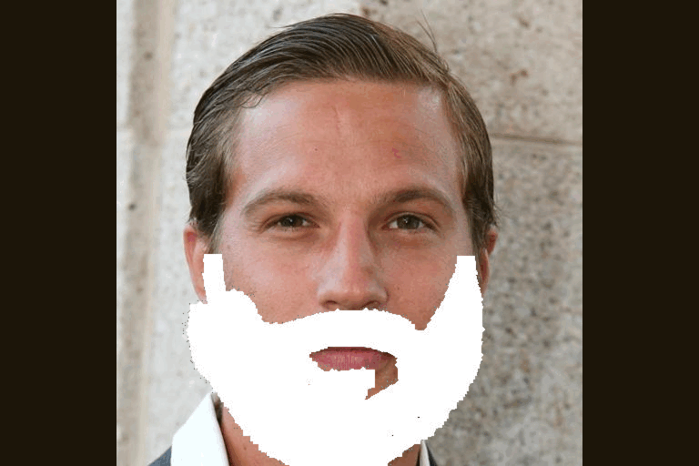
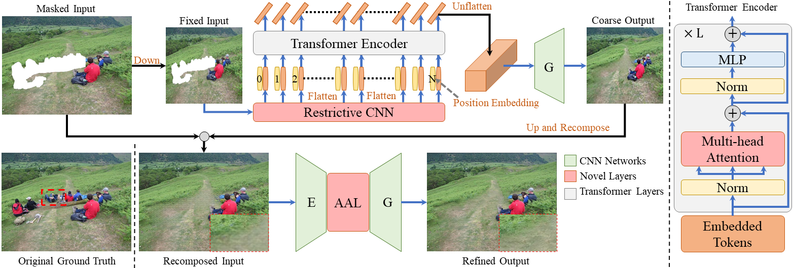
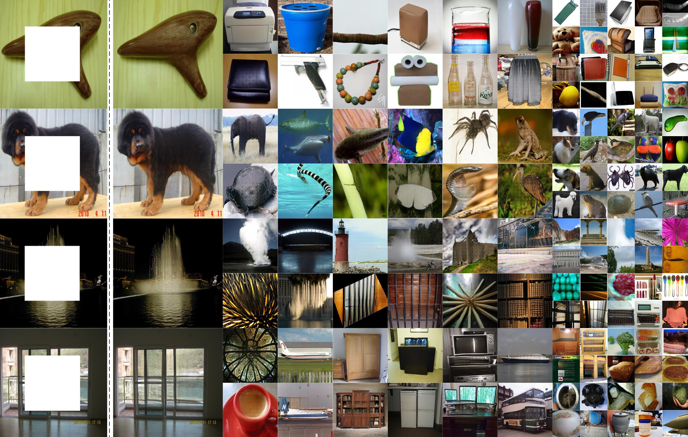
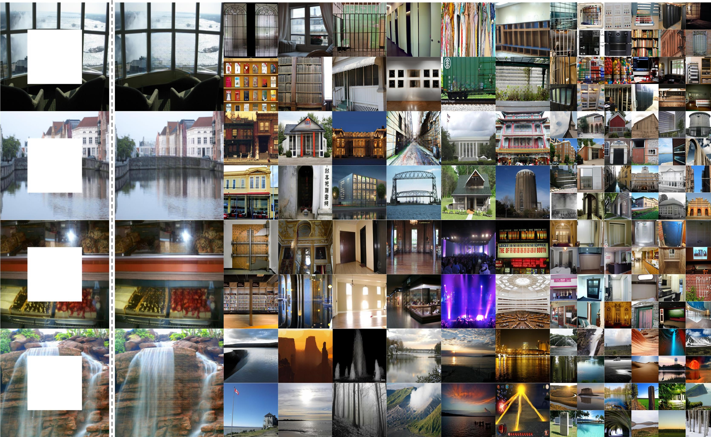
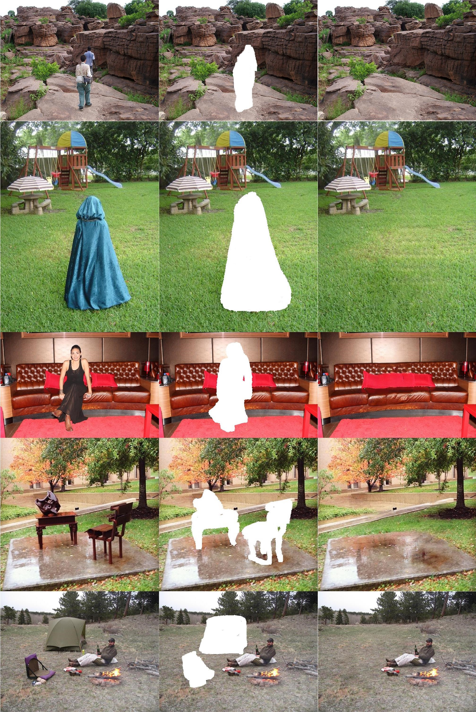

# TFill
[paper](https://openaccess.thecvf.com/content/CVPR2022/html/Zheng_Bridging_Global_Context_Interactions_for_High-Fidelity_Image_Completion_CVPR_2022_paper.html) | [arXiv](https://arxiv.org/abs/2104.00845) | [Project](https://chuanxiaz.com/tfill/) | [Video](https://www.youtube.com/watch?v=efB1fw0jiLs&feature=youtu.be)

This repository implements the training, testing and editing tools for "Bridging Global Context Interactions for High-Fidelity Image Completion (CVPR2022, scores: 1, 1, 2, 2)" by [Chuanxia Zheng](https://www.chuanxiaz.com), [Tat-Jen Cham](https://personal.ntu.edu.sg/astjcham/), [Jianfei Cai](https://jianfei-cai.github.io/) and [Dinh Phung](https://research.monash.edu/en/persons/dinh-phung). Given masked images, the proposed **TFill** model is able to generate high-fidelity plausible results on various settings.

## Examples


## Object Removal


## Object Repair


## Framework
We propose the two-stages image completion framework, where the upper content inference network (TFill-*Coarse*) generates semantically correct content using a transformer encoder to directly capture the global context information; the lower appearance refinement network (TFill-*refined*) copies global visible and generated features to holes. 




# Getting started

- Clone this repo:

```
git clone https://github.com/lyndonzheng/TFill
cd TFill
```
## Requirements
The original model is trained and evaluated with Pytorch v1.9.1, which cannot be visited in current [PyTorch](https://pytorch.org/get-started/previous-versions/). Therefore, we create a new environment with Pytorch v1.10.0 to test the model, where the performance is the same. 

A suitable [conda](https://conda.io/) environment named `Tfill` can be created and activated with:

```
conda env create -f environment.yaml
conda activate TFill
```
## Runing pretrained models
Download the pre-trained models using the following links ([CelebA-HQ](https://drive.google.com/drive/folders/1Qtb9KmW6tdKDbRHTs7bxh7KxOJk04Kcc?usp=sharing), [FFHQ](https://drive.google.com/drive/folders/1QzETuQHR9Nzp1eq5-yD7wwzT9ZYn05-W?usp=sharing), [ImageNet](https://drive.google.com/drive/folders/1R3vQY6PwjunOhyGuhIgOeAfGlzl3d7v0?usp=sharing), [Plcases2](https://drive.google.com/drive/folders/1R7aihruYkcekOXh1XVVIEHw5jvwynrIA?usp=sharing)
) and put them under```checkpoints/``` directory. It should have the following structure:

```
./checkpoints/
├── celeba
│   ├── latest_net_D.pth
│   ├── latest_net_D_Ref.pth
│   ├── latest_net_E.pth
│   ├── latest_net_G.pth
│   ├── latest_net_G_Ref.pth
│   ├── latest_net_T.pth
├── ffhq
│   ├── ...
├── ...
```

- Test the model
```
sh ./scripts/test.sh
```
For different models, the users just need to modify lines 2-4, including ```name```,```img_file```,```mask_file```. For instance, we can replace the *celeba* to *imagenet*.

The default results will be stored under the ```results/``` folder, in which:

- ```examples/```: shows original and masked images;
- ```img_out/```: shows upsampled *Coarse* outputs;
- ```img_ref_out/```: shows the final *Refined* outputs.

## Datasets
- ```face dataset```: 
  - 24,183 training images and  2,824 test images from [CelebA](http://mmlab.ie.cuhk.edu.hk/projects/CelebA.html) and use the algorithm of [Growing GANs](https://github.com/tkarras/progressive_growing_of_gans) to get the high-resolution CelebA-HQ dataset.
  - 60,000 training images and 10,000 test images from [FFHQ](https://github.com/NVlabs/ffhq-dataset) provided by [StyleGAN](https://github.com/NVlabs/stylegan).
- ```natural scenery```: original training and val images from [Places2](http://places2.csail.mit.edu/).
- ```object``` original training images from [ImageNet](http://www.image-net.org/).

## Traning

- Train a model (two stage: *Coarse* and *Refinement*)
```
sh ./scripts/train.sh
```
The default setting is for the top *Coarse* training. The users just need to replace the *coarse* with *refine* at line 6. Then, the model can continue training for high-resolution image completion.
More hyper-parameter can be in ```options/```. 

The coarse results using transformer and restrictive CNN is impressive, which provides plausible results for both **foreground** objects and **background** scene.




# GUI
The GUI operation is similar to our previous GUI in [PIC](https://github.com/lyndonzheng/Pluralistic-Inpainting), where steps are also the same.

Basic usage is:

```
sh ./scripts/ui.sh 
```
In ```gui/ui_model.py```, users can modify the ```img_root```(line 30) and the corresponding ```img_files```(line 31) to randomly edit images from the testing dataset.

## Editing Examples

- **Results (original, output) for face editing**


- **Results (original, masked input, output) for nature scene editing**



## Next
- Higher-resolution pluralistic image completion

## License
This work is licensed under a MIT License.

This software is for educational and academic research purposes only. If you wish to obtain a commercial royalty bearing license to this software, please contact us at chuanxia001@e.ntu.edu.sg.

## Citation

The code also uses our previous [PIC](https://github.com/lyndonzheng/Pluralistic-Inpainting). If you use this code for your research, please cite our papers.
```
@InProceedings{Zheng_2022_CVPR,
    author    = {Zheng, Chuanxia and Cham, Tat-Jen and Cai, Jianfei and Phung, Dinh},
    title     = {Bridging Global Context Interactions for High-Fidelity Image Completion},
    booktitle = {Proceedings of the IEEE/CVF Conference on Computer Vision and Pattern Recognition (CVPR)},
    month     = {June},
    year      = {2022},
    pages     = {11512-11522}
}

@inproceedings{zheng2019pluralistic,
  title={Pluralistic Image Completion},
  author={Zheng, Chuanxia and Cham, Tat-Jen and Cai, Jianfei},
  booktitle={Proceedings of the IEEE Conference on Computer Vision and Pattern Recognition},
  pages={1438--1447},
  year={2019}
}

@article{zheng2021pluralistic,
  title={Pluralistic Free-From Image Completion},
  author={Zheng, Chuanxia and Cham, Tat-Jen and Cai, Jianfei},
  journal={International Journal of Computer Vision},
  pages={1--20},
  year={2021},
  publisher={Springer}
}
```
